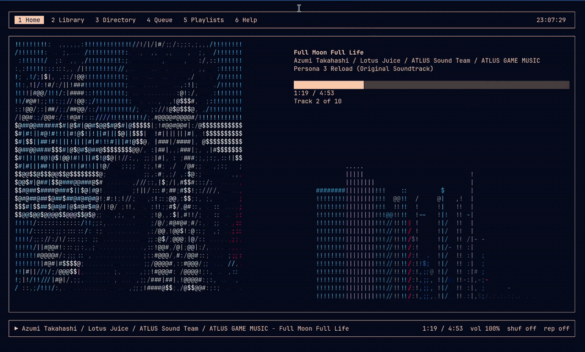

# Orpheus: A C++ Music Player



A terminal music player that browses your library, plays it, and renders the
album art as coloured ASCII with an FFT equalizer next to it.

- **Formats**: MP3, FLAC, WAV natively; M4A/AAC/ALAC, Opus, OGG, WMA, AIFF and
  friends through the optional FFmpeg decoding backend.
- **Library tab**: background scanner discovers albums from your tags, with an
  on-disk cache so the second launch is instant.
- **Playlists**: save the queue as an `.m3u8`, load/rename/delete saved
  playlists, and open any `.m3u`/`.m3u8`/`.pls` straight from the browser.
- **Whole-album playback**: queue or play an entire folder (recursively, in
  natural track order) with one key.
- **Album art**: ANSI-256 or grayscale, half-block or ASCII-ramp rendering.
- **Visualizer**: block / ANSI-art / braille / spectrogram styles, optionally
  coloured with a palette extracted from the current cover.
- **Vim-style navigation**: `j k`, `Ctrl-D`/`Ctrl-U`, `g`/`G`, wrap-around
  scrolling, and `/` for a recursive search below the current folder.

- available for Linux & macOS

## Build dependencies

- C++23 compiler (g++ 13+ / clang 17+)
- CMake 3.16+, pkg-config
- ncursesw
- TagLib
- Lua (5.3+)
- FFmpeg (`libavcodec`, `libavformat`, `libavutil`, `libswresample`), optional
  but required for M4A/AAC/ALAC/Opus/OGG

miniaudio and stb are vendored in `include/`.

## Installation

Debian/Ubuntu:
```bash
sudo apt-get install build-essential cmake pkg-config libncursesw5-dev \
  libtag1-dev liblua5.4-dev libavcodec-dev libavformat-dev libavutil-dev libswresample-dev
```

Fedora:
```bash
sudo dnf install gcc-c++ cmake pkgconf ncurses-devel taglib-devel lua-devel \
  ffmpeg-free-devel
```

Arch Linux:
```bash
sudo pacman -S base-devel cmake pkgconf ncurses taglib lua ffmpeg
```

macOS (Homebrew):
```bash
brew install cmake pkg-config ncurses taglib lua ffmpeg
```

### Building

```bash
cmake -B build -DCMAKE_BUILD_TYPE=Release
cmake --build build -j
sudo cmake --install build      # optional
```

CMake prints which decoding backends are active. FFmpeg is detected
automatically; force the decision with `-DENABLE_FFMPEG=ON` (hard error when
missing) or `-DENABLE_FFMPEG=OFF` (mp3/flac/wav only).

## Running

```bash
orpheus
```

Debug output goes to `orpheus_debug.log` in the working directory, since the
terminal belongs to ncurses.

## Keybinds

Press `6` (or `?`) inside Orpheus for the full list.

| Key | Action |
| --- | --- |
| `1`–`6`, `Tab`, `h`/`l` | Switch tabs |
| `p` / `Space` | Play / pause |
| `]` / `[` | Next / previous track |
| `,` / `.` | Seek −5s / +5s |
| `9` / `0` | Volume down / up |
| `s` / `r` | Shuffle / repeat (off → all → one) |
| `a` / `z` | Album-art palette / style |
| `v` / `c` | Visualizer style / colour source |
| `j` `k`, `Ctrl-D` `Ctrl-U`, `g` `G` | List navigation |
| `Enter` | Open folder, expand album, or play/queue a track |
| `e` / `P` | Queue selection / play selection now |
| `-`, `Backspace` | Up one directory |
| `/` | Recursive search below the current folder |
| `A` | Add the selection to a playlist (picker, with "new playlist") |
| `w` (Queue) | Save the whole queue as a new playlist |
| `d`, `X`, `J`/`K` (Queue) | Remove, clear, reorder |
| `q` | Quit |

### Building playlists

Playlists can be made inside the player itself.

- `A` in the Directory, Library, Queue or Home tab opens a picker listing every
  saved playlist plus `[+ new playlist]`. It files whatever is highlighted
  (a single track, a whole album, or a folder, recursively) into the chosen
  playlist, creating it if you pick the new-playlist row.
- `a` in the Playlists tab creates an empty playlist to fill in later.
- `w` in the Queue tab snapshots the entire queue.
- In the Playlists tab, `→` moves the cursor into the track list, where `J`/`K`
  reorder and `d` removes. Edits are written to disk immediately. `←` or `Esc`
  returns to the playlist list; `R` renames and `d` deletes the playlist itself.

Saved playlists are plain `EXTM3U` files with absolute paths, so they work with
mpv, VLC and friends. Any `.m3u`/`.m3u8`/`.pls` found while browsing can be
queued with `Enter` directly. Tracks queued from a remote library are saved as
`orpheus://<path>` lines; they play again whenever Orpheus is attached to a
server, and are skipped (and reported) in a local session.

## Remote playback over SSH

Orpheus has a daemon called `orpheusd` and you can run it on your remote sever 
where all your music is.

```bash
orpheus --remote nas            # ssh nas orpheusd --stdio
orpheus --socket /run/orpheusd  # a local daemon over a Unix socket
```

You can listen to your music and stream back to your local laptop. 

Transport uses `ssh <host> -- orpheusd --stdio` you just need ssh keys 
setup for the forwarding. 

Override the remote side with `--remote-cmd` if `orpheusd` is not on the remote `PATH`:

```bash
orpheus --remote nas --remote-cmd '/opt/orpheus/bin/orpheusd --stdio --root /srv/music'
```

Anything that is not in `~/.ssh/config` needs pass-through options.
`--ssh-opt` is repeatable and goes straight to `ssh`:

```bash
orpheus --remote 10.0.0.5 --ssh-opt -p --ssh-opt 2222 --ssh-opt -i --ssh-opt ~/.ssh/nas
orpheus --remote nas --ssh-opt -Jbastion.example.com
```

Set `remote_host` in the config to attach automatically at startup.

### On the server

```
orpheusd --root ~/Music --stdio      # what ssh invokes (the normal case)
orpheusd --root ~/Music --socket /run/orpheusd
orpheusd --no-scan                   # skip the startup album index
```

The server indexes the library on the remote server. Album track
lists are fetched only when you open or queue an album.

## Configuration

Orpheus writes a commented starter config to
`~/.config/orpheus/orpheus.lua` (or `$XDG_CONFIG_HOME/orpheus/orpheus.lua`) on
first launch. A copy lives in `config.lua` at the repo root.

```lua
return {
  music_dir       = "~/Music",
  art_color_mode  = "ansi",       -- "ansi" | "grayscale"
  art_render_mode = "block",      -- "block" | "detailed"
  visualizer      = "block",      -- "block" | "ansi" | "braille" | "spectrogram"
  dynamic_palette = true,
  show_hidden     = false,
  fps             = 30,
  volume          = 1.0,
  shuffle         = false,
  repeat_mode     = "off",        -- "off" | "all" | "one"  (`repeat` is a Lua keyword)
  scan_on_start   = true,
}
```

Plain globals (`music_dir = "~/Music"`) work too. A broken config never stops
Orpheus from starting: it warns in the log and falls back to defaults.

## Data locations

| Path | Contents |
| --- | --- |
| `~/.config/orpheus/orpheus.lua` | Configuration |
| `~/.local/share/orpheus/playlists/` | Saved playlists (`.m3u8`) |
| `~/.cache/orpheus/library.tsv` | Library scan cache |

All three honour the matching `XDG_*_HOME` variables.
